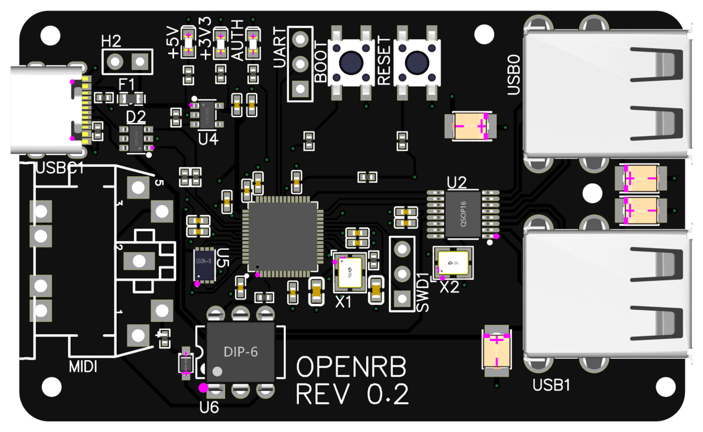

# OpenRB

**Play your MIDI drum kit as a pro-drums controller on Xbox One.**

  

OpenRB is a small, open-source adapter that lets an electronic drum kit act as an
official-style **pro drums** controller — so you can play the drums you already own on
your console. No proprietary dongle, no fragile workarounds.

## Why OpenRB

- 🎯 **Just works on Xbox One.** First-class Xbox One support with a genuinely simple
  setup — no complicated flashing rituals or PC-side configuration to keep it working.
- 🥁 **Use the kit you have.** Connects to drum kits over USB or a standard MIDI cable.
- 🔌 **One adapter, many instruments.** Built to support multiple instrument types from a
  single adapter (guitar support is on the way).
- 🛠️ **Open and yours.** Fully open-source firmware and hardware — build it yourself or
  run it on an off-the-shelf board.

## Get started in 3 steps

You don't need to be a programmer. You'll need an
[OpenRB board](https://github.com/delabrcd/openrb-pico-hw) (or an
[Adafruit Feather RP2040 USB Host](https://www.adafruit.com/product/5723)) and your drum
kit.

1. **Download** the latest firmware from the
   [Releases page](https://github.com/delabrcd/openrb-pico/releases) — pick
   `openrb-pico_FEATHER.uf2` for a Feather, or `openrb-pico_CUSTOM_REV_0_1.uf2` for the
   OpenRB board.
2. **Flash it:** hold the **BOOTSEL** button on the board, plug it into your computer with
   a USB cable, and drag the downloaded file onto the drive that appears (`RPI-RP2`). Done —
   it restarts on its own.
3. **Authenticate & play:** plug an official Xbox One / Series controller into the adapter
   and connect the adapter to your Xbox. When the **light comes on**, you're authenticated —
   swap the controller for your drum kit (or, on the OpenRB board's second port, just add
   it alongside) and start playing.

👉 **Step-by-step guide with photos and wiring:**
[Feather setup on the wiki](https://github.com/delabrcd/openrb-pico/wiki/Feather-USB-Host).

## How it compares

OpenRB is in the same family as **Santroller** and the **Roll Limitless** / PDP legacy
adapter. What sets it apart is out-of-the-box **Xbox One** support with a simpler setup,
and an architecture designed to adapt *many* instrument types from one adapter (using the
Rock Band Wireless Legacy Adapter protocol).

## Learn more

- 📖 **[Project wiki](https://github.com/delabrcd/openrb-pico/wiki)** — setup guides,
  features, and how it works.
- 💬 **[Releases](https://github.com/delabrcd/openrb-pico/releases)** — download firmware.
- 🔧 **[Hardware — openrb-pico-hw](https://github.com/delabrcd/openrb-pico-hw)** — the
  open KiCad board design (schematic, PCB, 3D models).

Developers: start with [`CONTRIBUTING.md`](CONTRIBUTING.md) and [`AGENTS.md`](AGENTS.md);
build/flash in [`BUILDING.md`](BUILDING.md); the design lives in the
[Architecture](https://github.com/delabrcd/openrb-pico/wiki/Architecture) wiki page.
